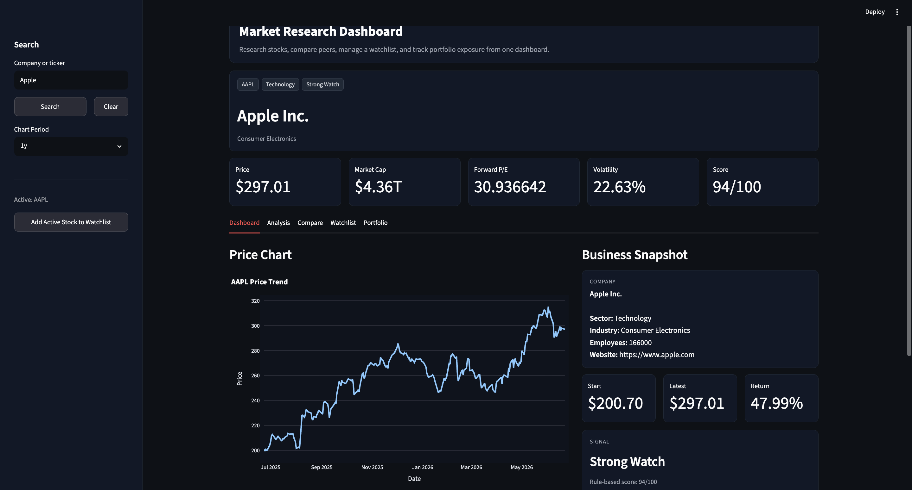
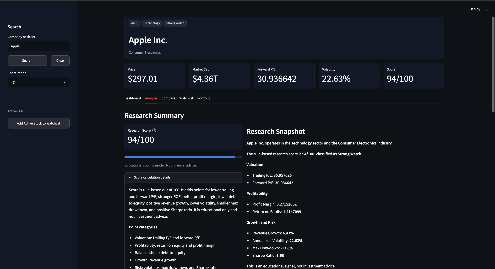
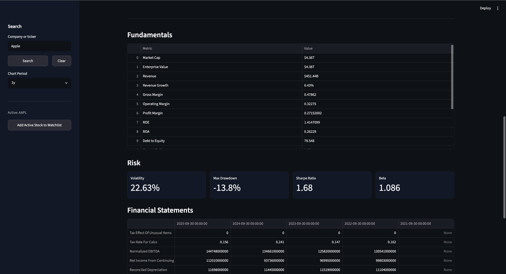
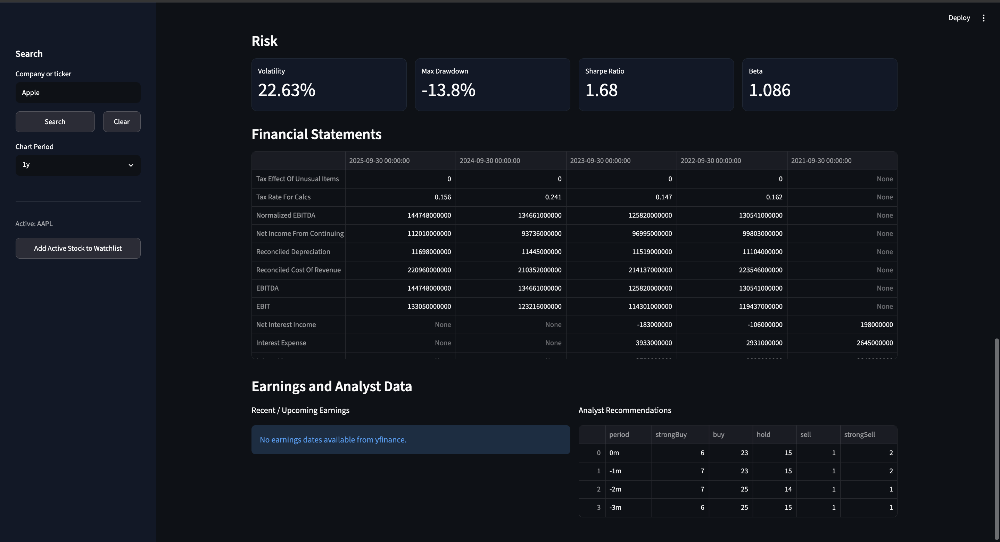
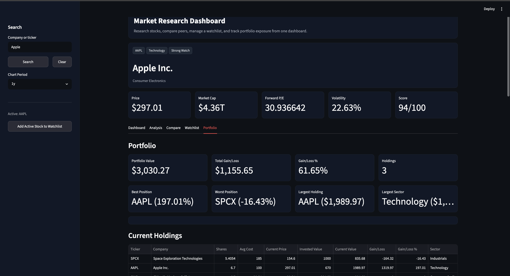
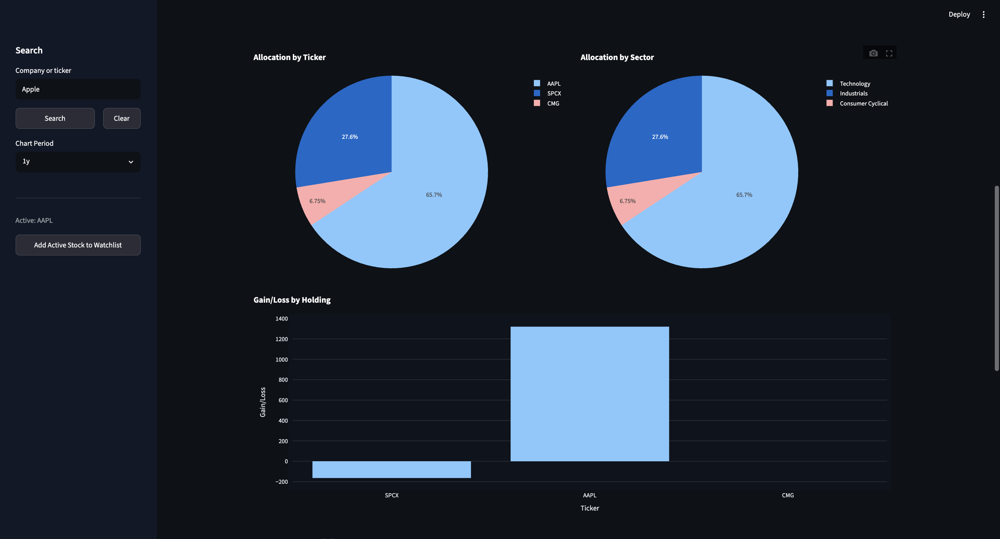

# AI Stock Research Platform

A stock research platform built with Python, Streamlit, and Yahoo Finance data.

The application combines company research, portfolio tracking, watchlist management, stock comparison tools, and custom research scoring in a single dashboard.

Built to explore financial analysis, valuation, portfolio analytics, and software engineering through a practical investing-focused project.

## Screenshots

### Dashboard



### Analysis







### Portfolio





## Features

### Company Research

- Company and ticker search
- Company profile information
- Sector and industry data
- Market capitalization
- Revenue and profitability metrics
- Valuation metrics
- Earnings and recommendation data

### Market Analysis

- Historical price charts
- Return calculations
- Volatility analysis
- Maximum drawdown analysis
- Sharpe ratio calculations
- Revenue growth analysis

### Research Scoring

The platform includes a custom rule-based scoring system that evaluates companies using:

- Valuation metrics
- Profitability metrics
- Revenue growth
- Debt levels
- Volatility
- Maximum drawdown
- Risk-adjusted returns

### Watchlist Management

- Add and remove securities
- Persistent local storage
- Live pricing
- Company tracking

### Portfolio Tracking

- Add and remove holdings
- Track shares and cost basis
- Live portfolio valuation
- Gain/loss calculations
- Allocation analysis
- Sector exposure analysis

### Company Comparison

- Compare multiple companies
- Compare valuation metrics
- Compare profitability metrics
- Compare risk metrics
- Compare research scores

## Tech Stack

- Python
- Streamlit
- yfinance
- pandas
- numpy
- plotly
- uv

## Installation

Clone the repository:

```bash
git clone https://github.com/asrh-82/ai-stock-research-platform.git
cd ai-stock-research-platform
```

Install dependencies:

```bash
uv sync
```

## Running the Application

```bash
uv run streamlit run app.py
```

## Project Structure

```text
ai-stock-research-platform/

├── app.py
│
├── Utils/
│   ├── data_utils.py
│   ├── portfolio_utils.py
│   ├── scoring.py
│   ├── ui_sections.py
│   └── valuation/
│
├── Data/
│   ├── portfolio.json
│   └── watchlist.json
│
├── screenshots/
│   ├── dashboard.png
│   ├── analysis1.png
│   ├── analysis2.png
│   ├── analysis3.png
│   ├── portfolio1.png
│   └── portfolio2.png
│
├── pyproject.toml
├── uv.lock
└── README.md
```

## File Responsibilities

### app.py

Application entry point and navigation.

### Utils/data_utils.py

- Company search
- Market data retrieval
- Price history retrieval
- Financial statement retrieval
- Earnings and recommendation retrieval
- Comparison dataset generation

### Utils/portfolio_utils.py

- Portfolio persistence
- Watchlist persistence
- Portfolio calculations
- Portfolio summaries
- Portfolio highlights
- Portfolio and watchlist management

### Utils/scoring.py

- Return calculations
- Volatility calculations
- Maximum drawdown calculations
- Sharpe ratio calculations
- Revenue growth calculations
- Research score generation

### Utils/ui_sections.py

- Dashboard rendering
- Analysis rendering
- Comparison rendering
- Watchlist rendering
- Portfolio rendering

## Current Development

Recently completed:

- Modular codebase refactor
- Portfolio tracking system
- Watchlist management
- Company comparison tools
- Research scoring framework
- UI cleanup and project restructuring

Currently working on:

- Valuation tools
- Discounted cash flow analysis
- Comparable company analysis
- Fair value estimation

## Notes

This project currently uses rule-based analysis and financial metrics.

No AI-generated investment recommendations are currently used within the platform.

## Disclaimer

This project is intended for educational and research purposes only.

Nothing contained within this application should be considered financial or investment advice.