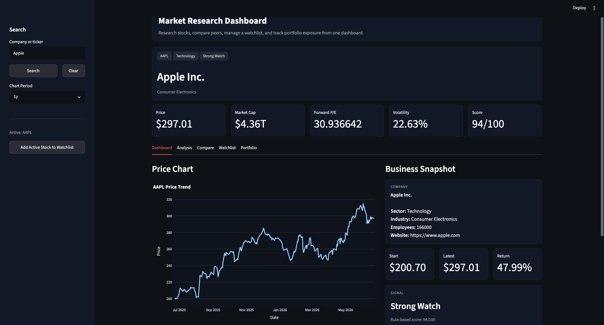
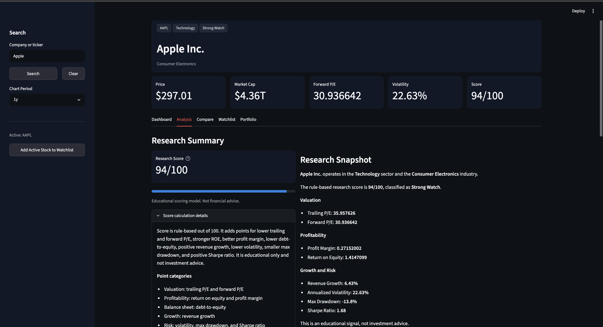
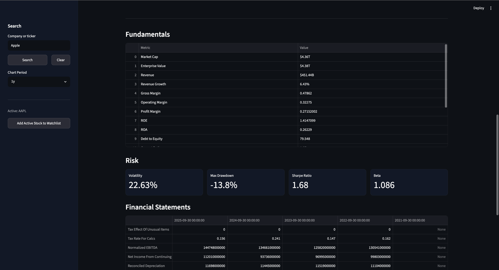

# AI Stock Research Platform

A focused equity research platform built with Python, Streamlit, and market data from Yahoo Finance.

The application combines company research, risk analysis, watchlist management, peer comparison, and custom research scoring in a single dashboard.

The product is being developed toward an end-to-end research workflow with editable DCF valuation, Monte Carlo valuation, strategy backtesting, and downloadable research reports.

## Screenshots

### Dashboard



### Analysis





## Features

### Company Research

- Company and ticker search
- Company profile information
- Sector and industry data
- Market capitalization
- Revenue and profitability metrics
- Earnings and recommendation data
- Historical market data

### Market Analysis

- Historical price charts
- Return calculations
- Volatility analysis
- Maximum drawdown analysis
- Sharpe ratio calculations
- Revenue growth analysis

### DCF Valuation

- Editable five-year revenue-growth and EBIT-margin forecast
- Unlevered free-cash-flow calculation
- Cash and debt bridge from enterprise value to equity value
- Implied value per diluted share
- Editable base, bull, and bear scenarios
- WACC and terminal-growth sensitivity analysis
- Explicit source and fallback warnings
- CSV forecast export

### Research Scoring

The platform includes a custom rule-based scoring system that evaluates companies using:

- Valuation metrics
- Profitability metrics
- Revenue growth
- Debt levels
- Volatility
- Maximum drawdown
- Risk-adjusted returns

### Watchlist Management

- Add and remove securities
- Persistent local storage
- Live pricing
- Company tracking

### Company Comparison

- Compare multiple companies
- Compare valuation metrics
- Compare profitability metrics
- Compare risk metrics
- Compare research scores

## Tech Stack

- Python
- Streamlit
- yfinance
- pandas
- numpy
- plotly
- uv

## Installation

Clone the repository:

```bash
git clone https://github.com/asrh-82/ai-stock-research-platform.git
cd ai-stock-research-platform
```

Install dependencies:

```bash
uv sync
```

## Running the Application

```bash
uv run streamlit run app.py
```

## Project Structure

```text
ai-stock-research-platform/

├── app.py
│
├── Utils/
│   ├── data_utils.py
│   ├── dcf.py
│   ├── dcf_data.py
│   ├── dcf_ui.py
│   ├── scoring.py
│   ├── ui_sections.py
│   └── watchlist_utils.py
│
├── Data/
│   └── watchlist.json
│
├── screenshots/
│
├── tests/
├── ROADMAP.md
├── pyproject.toml
├── uv.lock
└── README.md
```

## File Responsibilities

### app.py

Application entry point and navigation.

### Utils/data_utils.py

- Company search
- Market data retrieval
- Price history retrieval
- Financial statement retrieval
- Earnings and recommendation retrieval
- Comparison dataset generation

### Utils/dcf.py

- Pure DCF calculations and validation
- Scenario adjustments
- WACC and terminal-growth sensitivity calculations

### Utils/dcf_data.py

- Financial-statement line-item extraction
- Normalized DCF defaults
- Source labels and explicit fallback warnings

### Utils/dcf_ui.py

- Editable DCF assumptions
- Forecast, scenario, and sensitivity rendering
- Forecast CSV export

### Utils/watchlist_utils.py

- Watchlist persistence
- Watchlist add and remove operations
- Watchlist research table generation

### Utils/scoring.py

- Return calculations
- Volatility calculations
- Maximum drawdown calculations
- Sharpe ratio calculations
- Revenue growth calculations
- Research score generation

### Utils/ui_sections.py

- Dashboard rendering
- Analysis rendering
- Comparison rendering
- Watchlist rendering

## Current Development

Recently completed:

- Modular codebase refactor
- Watchlist management
- Company comparison tools
- Research scoring framework
- UI cleanup and project restructuring
- Research-only product refactor
- Testable DCF calculation engine
- Editable DCF valuation interface
- Base, bull, and bear scenario analysis
- WACC and terminal-growth sensitivity table

Currently working on:

- Stronger financial-statement normalization and source traceability
- Historical DCF input display
- Calculated WACC build-up with manual overrides
- Excel model export

Planned after the DCF foundation:

- Monte Carlo valuation with reproducible assumptions and percentile outputs
- Backtesting with transaction costs, benchmark comparison, and look-ahead-bias controls
- Comparable company analysis
- Excel, CSV, and PDF research exports
- Methodology and source-traceability views

See [ROADMAP.md](ROADMAP.md) for milestone scope and acceptance criteria.

## Notes

This project currently uses rule-based analysis and financial metrics. The initial valuation scope is U.S.-listed, non-financial companies because banks and insurers require different models.

No AI-generated investment recommendations are currently used within the platform.

## Disclaimer

This project is intended for educational and research purposes only.

Nothing contained within this application should be considered financial or investment advice.
